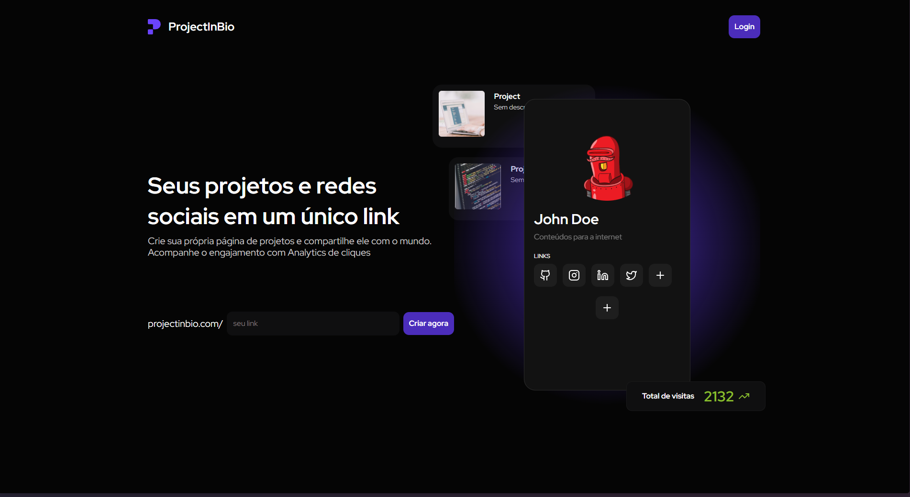

# ProjectInBio

## Seus projetos e redes sociais em um único link

O ProjectInBio é uma plataforma completa para centralizar seus projetos, redes sociais e informações de contato em um único link personalizado. Compartilhe tudo o que é importante com seus seguidores de forma fácil e organizada.

## Tecnologias

- **Next.js:** Framework React para construção de interfaces web modernas e performáticas.
- **Firebase:** Plataforma de desenvolvimento do Google com banco de dados, autenticação, armazenamento e outros serviços.
- **Resend:** Serviço de envio de emails transacionais para notificações e confirmações.
- **Stripe:** Plataforma de pagamentos online para processar assinaturas e doações.

## Funcionalidades

- **Criação de Links Personalizados:** Crie links personalizados com sua marca e nome de usuário.
- **Gerenciamento de Links:** Adicione, edite e organize seus links de projetos e redes sociais.
- **Página de Perfil:** Crie uma página de perfil com sua foto, descrição e informações de contato.
- **Integração com Redes Sociais:** Conecte suas contas de redes sociais para exibir seus perfis.
- **Estatísticas de Acesso:** Acompanhe o número de cliques em seus links e obtenha insights sobre seu público.
- **Autenticação com Google:** Faça login de forma rápida e segura com sua conta Google.
- **Assinaturas e Doações:** Receba pagamentos de seus seguidores através do Stripe.

## Como Usar

1. **Crie sua conta:** Acesse o ProjectInBio e crie sua conta gratuitamente.
2. **Personalize seu link:** Escolha um nome de usuário e personalize seu link.
3. **Adicione seus links:** Adicione seus links de projetos, redes sociais e informações de contato.
4. **Compartilhe seu link:** Divulgue seu link em suas redes sociais, currículo ou onde mais desejar.

## Contato

- **Email:** [bentesmoourao@gmail.com]

## Link em Produção

Acesse a versão em produção do ProjectInBio através do seguinte link:

[ProjectInBio - Produção](https://projectinbio-taupe.vercel.app/)